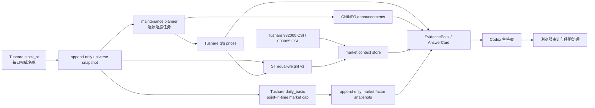

# v8 下一阶段 PRD：全量 ST 数据面、相对市场语境与时点市值

状态：P2/P3/P4 及 P5-C14 implemented and validated
日期：2026-07-22
负责人：Codex commander window  
实施分支：`codex/c14-point-in-time-market-cap`

后续 P6 已拆成管理人模式、重整前独立价值区间和重整方案价值重估；
架构、客观校准机制与实施队列见 `V8_P6_INSIGHTS_PRD.md` 和 `.todos/`。

## 1. 结论先行

v8 的研究主链已经成立：Codex 是主 LLM，浏览器只承担经验查看、审计和人工治理；证据网关、答案卡、研究账本、经验治理和按股可恢复的数据维护器都已存在。下一阶段不是再造一套 LLM 或再增加一个“浏览器审计智能体”，而是补齐研究主链下方的数据控制面。

这轮要解决两个根问题：

1. 把“每次手写三只股票”升级为“权威每日 ST 名单自动生成全量、可恢复的维护计划”。
2. 把“个股涨跌幅”升级为“个股 + ST 板块 + 中证2000 + 全市场”的同窗收益与相对差。

推荐方案是三层 benchmark pool：

- 正式研究基准：内部透明、可复算的 `st_equal_weight_v1`，使用当日 ST 名单和当日个股前复权收益计算。
- 中小盘风格基准：中证2000 `932000.CSI`，表达中小盘风险偏好和资金风格强弱；它是价格指数，不等同于资金净流入额。
- 市场方向基准：中证全指 `000985.CSI`。
- 厂商 ST 指数：以后可作为界面旁证接入，但因成分与方法不够透明，不作为事实机制证据，也不阻塞正式答案。

## 2. 为什么现在只更新三只

迁移时的严格 ready manifest `FM-80BBDB82E86E45DC888E` 研究范围只有 `000408`、`002289`、`603389`。那时维护 CLI 要求显式重复传入 `--symbol`，所以只维护“本次声明的研究范围”，不会自行把数据库里所有股票或名称中带 ST 的股票当作正式 universe。

这个设计最初是安全边界：防止迁移期一条命令误写两百多只股票、把失败请求伪装成全库新鲜度。但它缺少下一层“权威 universe → 批量任务”的控制器，所以停留在三只不是整体架构完善后的刻意安排，而是当前尚未补完的能力。

P1 dry plan 在执行前的盘点结果：

| 项目 | 结果 | 解释 |
| --- | ---: | --- |
| 2026-07-20 现役 ST 名单 | 209 只 | 来自 Tushare `stock_st` 的指定交易日快照 |
| 本地有前复权价格历史 | 205 只 | 另有 4 只没有价格基线 |
| 价格已到 2026-07-20 | 4 只 | 大部分是“有历史但没有追到最新” |
| 本地有基础公告 | 202 只 | 7 只在基础库无公告记录 |
| 基础公告最晚日期 | 2026-06-28 | 新鲜度不能由全库最大值替代逐股核查 |

该缺口现已关闭：209 只均完成逐股价格和 CNINFO 核查，全量严格 manifest 为 `FM-D836EE706EAA2BDE08DC`，绑定 universe `SU-4228A7C5B06703A022EF`。因此“三只”只保留为旧 research-scope manifest 的历史含义，不再是日常维护上限。

## 3. 产品边界与角色

### 3.1 Codex commander window

- 理解问题、选择 lens、调用证据工具、形成答案、登记数据债。
- 决定何时需要刷新、补公告正文或追加外部事实。
- 不直接把未经验证的网页内容写成正式结论。

### 3.2 浏览器/网页端

- 展示答案卡、运行审计、来源、经验候选和人工治理结果。
- 沉淀被接受的经验，供 Codex 后续检索。
- 不是第二个主 LLM，也不拥有独立研究结论。

“浏览器审计窗口”只是同一条 Codex 研究运行的可视化审计面，不是新增的多智能体架构。

### 3.3 数据维护任务

- 是唯一允许调用 Tushare/CNINFO 并写入维护资产的边界。
- 读取权威 universe，展开为逐源逐股任务。
- 每个任务保留 checkpoint、失败原因和 checked-through；可中断、可重跑。
- 不能因为某只股票移出 ST 名单就推断其退市。

## 4. 当前 v8 能力盘点

| 能力 | 状态 | 证据/备注 |
| --- | --- | --- |
| Codex 主研究入口 | 已完成 | `README.md`、`OPERATING_MODEL.md` |
| 冻结 lens 与答案卡脊梁 | 已完成 | 9 条 v7.4 lens record；答案契约与绑定测试 |
| EvidencePack、来源与红线校验 | 已完成 | `evidence_gateway.py`、`orchestrator_v2.py` |
| 问题卡、研究运行账本、数据债 | 已完成 | memory/query/answer contracts |
| 公告正文按需材料化 | 已完成 | `announcement_body.py` |
| 外部事实选择性补证 | 已完成 | `SELECTIVE_EVIDENCE_ARCHITECTURE_2026_07_15.md` |
| 经验候选、接受/拒绝、registry | 已完成 | `experience_governance.py`、Experience Center |
| 按股 Tushare 价格/CNINFO 公告刷新 | 已完成并全量验收 | 209/209 到目标日；批次、节流、重试、resume、run summary 已具备 |
| 逐源逐股 checkpoint + manifest | 已完成并全量验收 | v1 manifest 绑定 universe provenance，不以全库最大日期冒充逐股 freshness |
| 权威每日 ST universe | 已实现并真实验收 | `SU-4228A7C5B06703A022EF`，2026-07-20，209 只 |
| universe 自动展开批量任务 | 已完成并真实验收 | `refresh --universe-current` / snapshot；同 snapshot 重跑范围稳定 |
| 大盘基准存储与刷新 | 已完成并真实验收 | 中证全指 2016-01-04 至 2026-07-20，共 2,560 点 |
| 历史 ST membership | 已回填，历史 partial | 333,858 行、2,399 个源日期；源起点 2016-08-09，连续区间自 2021-03-17 |
| 内部 ST 等权指数 | 已物化，当前 ready | 2021-03-17 至 2026-07-20 共 1,295 点；最近连续 13 日覆盖率 ≥95% |
| 答案卡相对 ST/大盘指标 | 已完成 | 同窗消费 ST/中证2000/中证全指；个股 dossier 增加个股序列；`D-051C` 已关闭 |
| 全量 209 只价格/公告刷新与 universe manifest | 已完成 | `FM-D836EE706EAA2BDE08DC`，价格至 2026-07-20、公告核查至 2026-07-21 |
| market-context manifest | 已完成 | `MC-F15756CDF3490173508B`；ST/中证2000/中证全指同池，当前 ready、历史 partial 分开表达 |
| 市值/微盘因子 | 已完成并真实验收 | 起点快照 `MFS-61A1FC03A4CD04164329`；208/211 有效市值，覆盖 98.58%；`C14` 已关闭 |
| SDK 质量门与旧入口退役 | 未完成 | 原 PRD Phase 4/5 延续项 |

## 5. 架构评审

### 5.1 当前架构

当前把三件事混在 CLI 参数里：

- 数据库持有什么股票；
- 当天哪些股票属于 ST；
- 本次研究声明要核查哪些股票。

`--symbol` 同时承担 universe 与 task scope，导致手工三只成为事实上的维护上限。价格与公告各自有可靠的逐股 checkpoint，但没有 universe snapshot、批次计划和全量覆盖汇总。

### 5.2 如果今天从零设计

会明确拆成四层：

1. Membership：某交易日哪些股票属于 ST，来源、日期、digest 可追溯。
2. Holdings：本地各数据源实际持有哪些 symbol、最新到哪天。
3. Maintenance plan：用 membership 与 holdings 的差集生成任务，逐项 checkpoint。
4. Research scope：某个问题真正消费哪些股票和哪些基准，不必总是全量。

本轮保留现有可靠的价格/公告服务，只新增前两层之间的 universe 控制器和独立 market-context 数据面，属于可逆的小步扩展，不重写答案系统。

### 5.3 方案比较

| 方案 | 优点 | 风险 | 决定 |
| --- | --- | --- | --- |
| 用 `stocks_meta.is_st` | 无新接口 | 是旧快照，容易幸存者偏差和状态漂移 | 拒绝 |
| 用名称正则识别 `ST/*ST` | 简单 | 名称时点不可靠，无法表达撤销/实施事件 | 拒绝 |
| Tushare `stock_st` 每日快照 | 日期明确、当前权限可用、可回溯 | 历史回填请求量较大 | 采用，canonical membership |
| 直接用厂商 ST 指数 | 与行情软件观感接近 | 方法、成分、授权和接口稳定性不透明 | 仅 context-only |
| 内部当前成分等权回算 | 快 | 严重幸存者偏差 | 拒绝 |
| 内部逐日成分等权指数 | 透明、可复算、可解释覆盖率 | 需每日 membership 与价格覆盖 | 采用，canonical ST benchmark |

## 6. 目标数据流

Universe、价格、公告、基准各自有独立 freshness。只有任务声明需要相对市场语境时，基准缺失才成为该答案的 blocker；不会把所有问题一刀切阻塞。

## 7. Universe 契约

每个 snapshot 至少包含：

- `snapshot_id`、`contract_version`、`as_of`、`fetched_at`；
- `source_id=tushare_stock_st`；
- 排序后的成员：`symbol`、`ts_code`、名称、当日风险类型；
- `content_digest`；
- 相对前一 current snapshot 的 `added_symbols`、`removed_symbols`。

规则：

- snapshot 只追加，不覆盖历史文件；current 只是原子 pointer。
- 空响应、日期错位、非法代码全部 fail closed。
- `removed` 只代表不在下一快照，不等于退市；退市由独立上市状态/生命周期证据决定。
- 全量维护可以读取 current 或指定 snapshot，保证重跑同一批时范围不漂移。

## 8. 市场基准契约

### 8.1 基准 registry

每条定义包含：`benchmark_id`、名称、类别、provider/code、methodology_version、return_type、evidence_role 和 notes。

首批正式基准：

- `csi_all_share`：中证全指 `000985.CSI`，表达大盘方向。
- `csi_2000`：中证2000 `932000.CSI`，表达中小盘风险偏好和资金风格；不得由价格涨跌推导资金净流入金额。
- `st_equal_weight_v1`：内部 ST 等权价格指数，表达 ST 板块方向。

三者属于同一个 canonical pool，但职责不同：`stock−ST` 分离个股与 ST 板块，`ST−CSI2000` 分离 ST 与中小盘风格，`CSI2000−全指`观察中小盘相对全市场强弱。
由于中证2000源端历史从正式发布日期 2023-08-11 开始，四条序列的共同可比窗口从该日开始；更早的 ST/全市场历史仍可单独使用，但不能伪装成完整 pool 对比。

### 8.2 ST 等权 v1 方法

对交易日 t：

1. 读取 t 日 `stock_st` membership；不得用当前名单代替历史名单。
2. 读取成员 t 日 qfq 个股收益。
3. 对有有效收益的成员等权平均；停牌/缺数据不填 0。
4. 输出 `member_count`、`valid_member_count`、`coverage_ratio`。
5. coverage 低于门槛时，指数点可保存但不得作为 ready 证据。

v1 ready 门槛已冻结为 95%。真实回填显示历史覆盖率不均，因而采用双层状态：最新连续区间达标则 `current_status=ready`；任何源日期空洞或低覆盖历史点令 `historical_status=partial`。截至 2026-07-20，最新覆盖率为 98.56%，最近连续 13 个交易日达标，最近 10 日最低覆盖率为 96.23%。

### 8.3 答案中的相对量

两周窗口必须同时显示：

- `stock_return`：个股绝对收益；
- `st_return`：ST 等权指数收益；
- `market_return`：中证全指收益；
- `small_cap_return`：中证2000收益；
- `stock_minus_st`：个股相对 ST 超额；
- `stock_minus_small_cap`：个股相对中证2000差；
- `st_minus_small_cap`：ST 相对中证2000差；
- `stock_minus_market`：个股相对大盘超额；
- `st_minus_market`：ST 风格相对大盘。

这些差值是描述性的百分点差，不包装成 alpha、资金净流入或因果因子暴露。四条序列必须使用同一交易日边界；任一基准缺端点时返回 gap，不做自然日插值。

### 8.4 P4 答案契约决定

P4 不发布新的 AnswerCard contract。冻结的 v0 已明确允许 `body_rows` 以 `row_id` 承载无损扩展；本轮用稳定的行类型 `市场对比摘要`、`市场对比序列`、`市场对比缺口` 表达摘要和 11 个同窗端点，现有 API 与消费者不需要迁移。

只有未来需要多窗口、多频率，或消费者必须在顶层字段上做强类型随机访问时，才发布新版本。不能因为加一张图就让所有答案卡消费者承担合约迁移成本。

### 8.5 C14 时点市值契约

C14 使用独立 `market_factors_v1.sqlite3`，不把市值塞进个股价格库或 market-context
基准表。维护任务对每个交易日只拉取一次 Tushare `daily_basic` 横截面，再按该日
`st_membership_daily` 精确过滤；源端“万元/万股”统一换算为人民币元/股。没有该日历史
membership 时直接失败，绝不拿当前名单补历史。

每份快照内容寻址并 append-only；每个交易日有一份不可变 dated manifest，另有可替换的
current pointer。消费者按收益窗口起点选择 dated manifest，因此日常刷新不会覆盖未来滚动
窗口所需的历史因子。manifest 同时冻结因子日期、membership digest、覆盖率、
来源和定义。`st_total_mv_bottom_30pct_v1` 的规则是：在收益窗口起点、有效总市值的 ST
成员中升序排列，取最小 30%（向上取整），阈值同值全部进入微盘组，其余为普通 ST。
收益窗口终点或“今天”的市值不参与分组。

市值覆盖率以及微盘/普通 ST 各自的收益端点覆盖率均需达到 95%。缺失端点不插值；资产
不存在、日期错位、digest 不一致或覆盖不足时，答案卡输出 `市值分层缺口`。这是已实现
能力的运行证据缺口，不是重新打开 `C14`。稳定行类型为 `市值分层定义`、两行
`市值分层分布`、`市值分层比较摘要` 和 `市值分层缺口`；现有 AnswerCard v0 的
`body_rows` 可无损承载，因此仍不发布无必要的新契约版本。

## 9. 功能需求与验收

### FR-1 权威 universe materialization

- 给定交易日，拉取并写入 append-only snapshot。
- 同内容重复运行幂等。
- 相邻快照产生新增/移除 diff。
- 空响应和日期错位拒绝提升 current。

### FR-2 全量维护计划

- `refresh` 接受 current universe 或指定 snapshot。
- 逐源逐股执行，单股失败不抹去其他成功 checkpoint。
- 结果必须报告总任务、成功、跳过、失败和缺基线清单。
- 首次无价格/公告基线的股票进入显式 bootstrap 队列，不得让同一个全局 `--start-date` 悄悄重刷所有历史。

### FR-3 Universe freshness

- manifest 明示 membership as-of、member count 和 digest。
- 价格、公告按 209 只汇总 missing/stale/current。
- 退市股票使用生命周期终点，不要求在退市后继续产生价格。

### FR-4 市场基准

- 中证全指增量刷新到声明交易日。
- 中证2000增量刷新到声明交易日，并与中证全指、ST 等权共同进入 required benchmark pool。
- ST 等权指数由逐日 membership + qfq returns 物化。
- 每点有覆盖率，低覆盖率不得标 ready。
- 基准与股票库分库存储，答案路径只读。

### FR-5 答案消费

- 两周涨跌答案同时呈现个股、ST、中证2000、中证全指收益，以及职责清晰的相对差。
- provenance 指向 universe snapshot、价格 snapshot、benchmark definition 和 series as-of。
- P4 关闭 `D-051C`；微盘/市值能力保持独立，由 FR-6 验收并关闭 `C14`。

### FR-6 时点市值与微盘分层

- 每个需支持的交易日保存与该日 ST membership 绑定的市值快照。
- 微盘分组只使用收益窗口起点总市值，不得使用当前或窗口终点市值。
- 输出两组覆盖率、均值、中位数、尾部、上涨占比、中位市值及相对百分点差。
- provenance 指向 factor snapshot、factor manifest 和历史 membership；缺口 fail closed。

### FR-7 运行安全

- 默认 dry plan 后才允许 full universe 网络写入。
- 支持限速、批次大小、resume 和失败重试。
- 不将 token、cookie 或机器绝对路径写进 repo 文档和输出资产。

## 10. 非目标

- 不新增另一个浏览器 LLM 或浏览器研究主链。
- 不在本轮重写冻结的 v8 答案契约；如 typed API 需要新增字段，发布新版本。
- 不把雪球/论坛帖子变成 universe 或 benchmark 的权威来源。
- 不用厂商 ST 指数替代透明内部指数。
- 不在 PRD 评审前直接启动 209 只股票的全历史公告/价格重刷。

## 11. 发布门槛与当前结论

本阶段完成必须同时满足：

1. universe 与 benchmark 聚焦测试通过，全套 Python/Web 回归无新增失败；
2. 实际 materialize 一份非空的 2026-07-20 universe，数量与源端一致；（已达到：209）
3. 生成全量 dry plan，并显式列出无基线股票；（已达到：价格 4、公告 7）
4. 中证全指可增量刷新并进入 market-context manifest；（已达到）
5. ST 等权指数至少完成一段覆盖率合格的 shadow run；（已达到）厂商旁证因公开端点空响应、当前 Tushare 权限不足而保留为非阻塞 context-only 项；
6. 答案卡显示相对指标且 `D-051C` 不再出现；（已达到）
7. commander window 的运行说明与恢复步骤更新。（已达到）
8. C14 有真实起点快照、双组覆盖门、AnswerCard/Narrative/Web 消费和 current-v2
   路由验收，且答案不再发出 `C14`。（已达到）

P2/P3 的发布结论：canonical 数据面已经可以日常运行。最近 10 个交易日中证2000累计收益为 -19.30%，内部 ST 等权为 -12.79%，中证全指为 -11.22%；这一窗口里中小盘风格弱于 ST，ST 又略弱于全市场。该结果验证了不能把近期跌幅都归因于 ST，也验证了中证2000进入同一参考池的必要性。它是维护验收数据，不是交易结论。

P4 发布结论：答案引擎已在 manifest 声明的同一交易日窗口上消费四条序列，个股缺价、基准缺端点、ST 覆盖率低于 95%、universe as-of 与窗口终点不一致时均返回 evidence gap。网页端显示四项收益与起点归一为 100 的曲线，并明确百分点差不是资金净流入或 alpha。

`D-051C` 于 2026-07-21 关闭。关闭证据是：market-context manifest `MC-F15756CDF3490173508B`、universe snapshot `SU-4228A7C5B06703A022EF`、`market_comparison.py` 的只读对齐器、当前 v1 路由/种子/golden 覆盖层，以及后端 22 项聚焦测试、Web 32 项测试和生产构建。v0 验收文件保留原始缺口表述，只作历史基线；当前验收不再发出 `D-051C`。

`C14` 于 2026-07-22 关闭。真实起点快照 `MFS-61A1FC03A4CD04164329` 绑定
2026-07-06 的 211 只历史 ST 成员，其中 208 只有有效总市值，覆盖 98.58%，当前 manifest
为 `MF-7112DE9643948A1C7BD7`。微盘阈值为 20.61 亿元，阈值同值纳入后微盘 63 只、普通
ST 145 只；收益端点覆盖分别为 60/63（95.24%）和 142/145（97.93%）。该窗口微盘相对
普通 ST 的平均收益差为 +0.65 个百分点、中位收益差为 -3.34 个百分点，二者只作历史
横截面描述，不是 alpha。关闭证据包括独立因子数据面、只读比较器、AnswerCard/Narrative/
Web 消费、current-v2 路由/种子/golden 覆盖层和完整回归；v0/v1 历史验收原件不改写。
